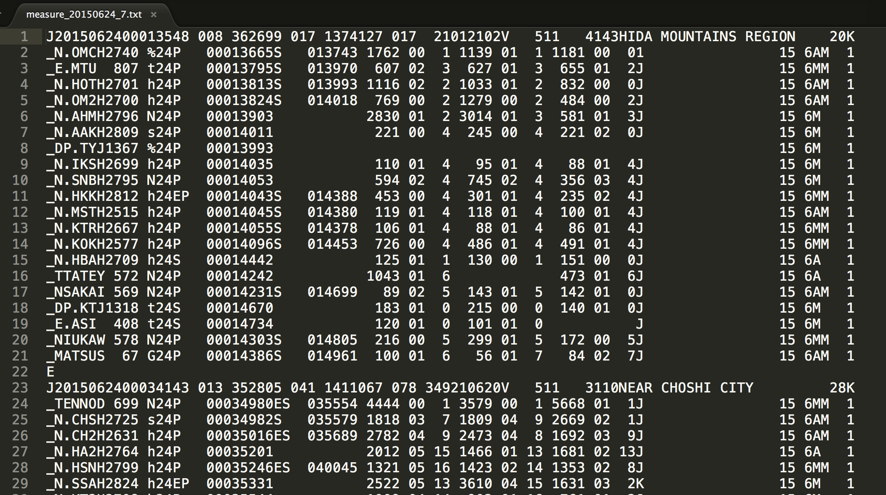
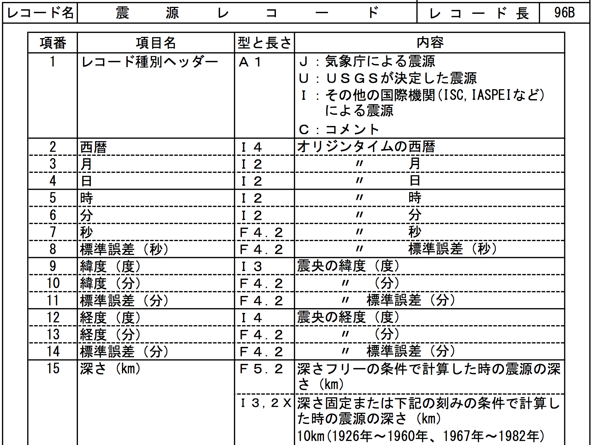
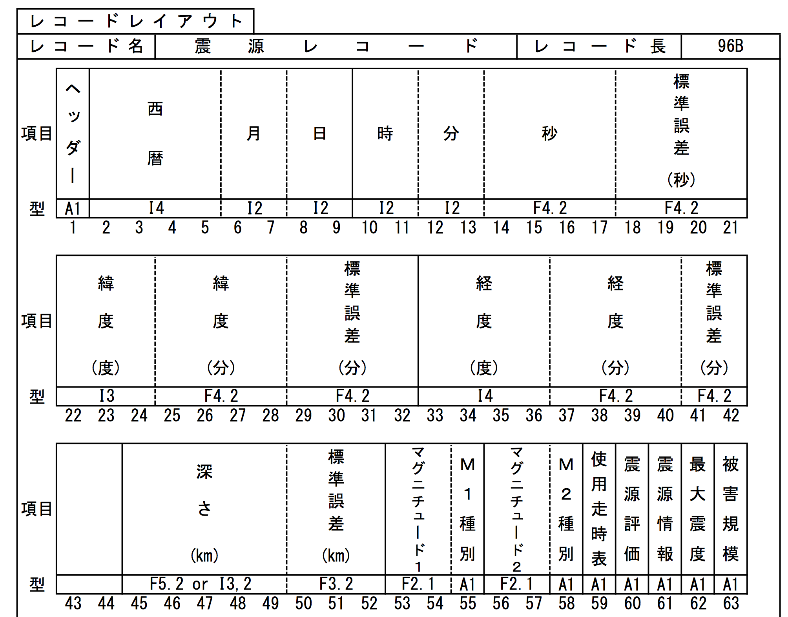
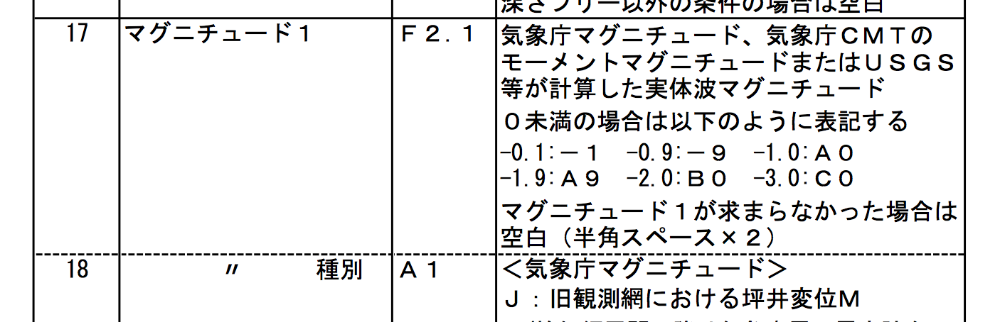

## 固定幅フォーマットのデータ処理

「綺麗なデータ」には、主に以下の種類がある。

* CSV系:コンマやタブ、空白などで区切られたデータ（エクセルのような表形式）
* XML:XMLフォーマットのデータ（表形式では表現しにくい場合、例として五輪公式データ）
* JSON:JSONフォーマット（Javascriptで使いやすいデータ）
* 固定幅:何文字目が何を表すと決まっているデータ

### 固定幅データ

通信速度が低く、メモリーも貴重だった時代から使われているデータには、いまでも固定幅(fixed-width)のフォーマットが使われています。

例えば、気象庁などが配信しているネットワーク「Hinet」の地震データは以下のような姿をしています。
この場合、地震１件につき、１行目が震源情報を、_で始まる行（複数）がその地震を計測した観測所のデータを表しています。

この種のデータを使いやすいデータ(エクセルの表など)に変換しなければならない場合もあるでしょう。

まず、フォーマットの定義書類を入手します。大抵、以下のような体裁です（Hinetの場合）

ほとんどの場合、レイアウト情報もついてきます。

例えば、地震の時間は、1)２文字目から５文字目までが西暦、2)６、７文字目が月（途中略）、3)14文字目から17文字目が、小数点２けたの秒を表すことになります。

22文字目からは震源の緯度ですが、単位は分が出てきます。１度は60分なので、換算が必要になるでしょう。

53文字目と54文字目にある「マグニチュード」にも注意が必要です。定義は以下のようになっています。

マグニチュードは（なんと！）マイナスがあり、マイナスを表すために１文字使うことを惜しんで、-0.1を「-1」、-2.2を「B２」のように表示しています。ということは、文字列「B2」を数字の-2.2に変換しなければ、平均などを計算したり、グラフを描いたりすることに使えません。

### 練習問題

フォルダにあるデータは、毎週の震源データです。フォーマット定義書のPDFもあります。

箱根地区で観測された全地震を抜き出し、発生時刻、緯度、経度、マグニチュード、深さを抜き出してください。緯度経度は度単位(37.864度など)に統一してください。なお、箱根地区の小地域番号は98です。

Excelでも、OpenOffice(Calc)でも、openRefineでも、Rでも道具は自由です。

